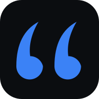
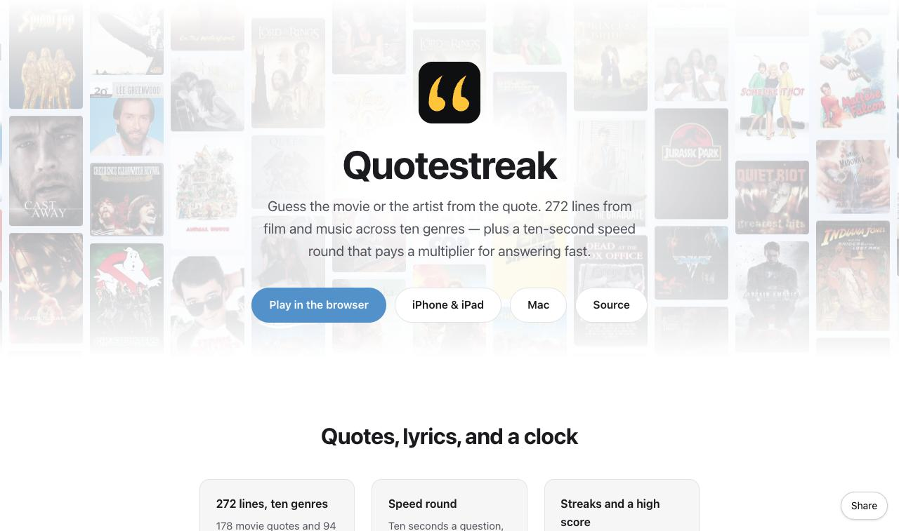
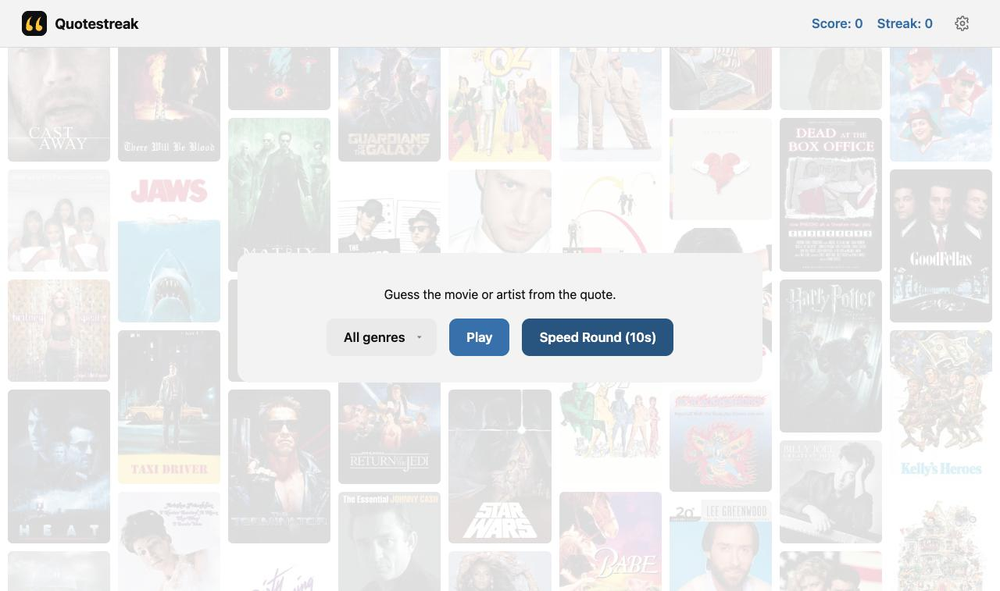
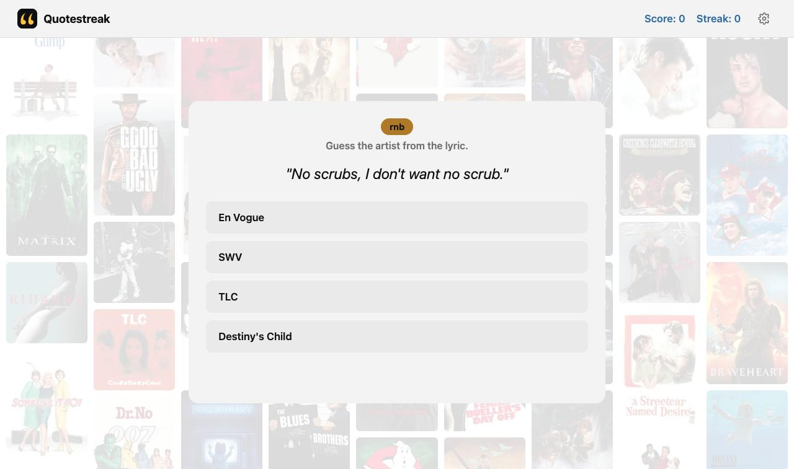
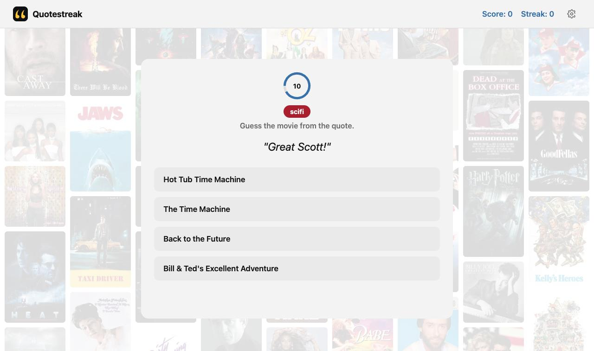
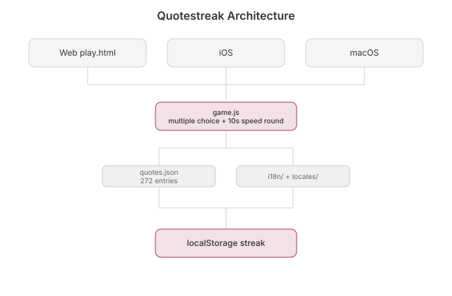

# Quotestreak

  [](https://github.com/nulljosh/quotestreak)

Here's the line. Name the movie.

Multiple choice, or a 10-second speed round that pays more the faster you answer. 272 entries, 178 movie quotes and 94 lyrics, across 10 genres.

Dad's idea.

## Screenshots

<p>


</p>
<p>


</p>

## Run

```
python3 -m http.server
```

Open `http://localhost:8000`.

## Structure

- `index.html`: the landing page. Self-contained. The hero is a drifting wall of posters and album art built from `quotes.json`
- `play.html`, `style.css`, `game.js`: the game
- `quotes.json`: the bank. `type: movie|music`, `genre`, `quote`, `answer`, `options`
- `ios/`: native SwiftUI, on the App Store as **Quotestreak**
- `macos/`: native SwiftUI on the same sources. Built, not yet submitted

## Roadmap

- **App Store.** iOS shipped as Quotestreak, a native SwiftUI rewrite. `macos/` is still a WKWebView wrapper and has to go native before it can be submitted.
- **More music.** The lyric entries are hand-seeded. The keyless iTunes Search API (`itunes.apple.com/search`) could supply song and artist pairs without writing trivia by hand.
- **More quotes.** Same idea for movies, from one of the free quote datasets on GitHub, if a bigger bank is wanted.

## License

MIT 2026, Joshua Trommel

## Whitepaper

[Technical whitepaper](WHITEPAPER.md)

## API and agent tools

An agent can play too. Game state and controls are exposed through WebMCP. See [docs/API.md](docs/API.md).

## Architecture


